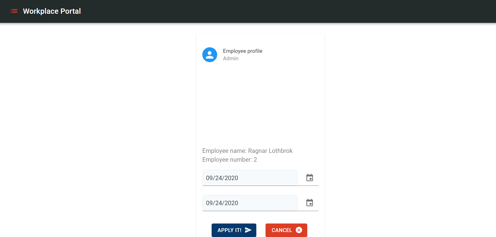

# Our product is:
Web portal that helps multinational companies with hot desk policy to ease the
returning of their employees back to the office after COVID-19 lockdown. 

it provides: 
* semi-automated system that helps with work schedule.
* visual representation for the office place(customazible).
* access to the latest data about Covid-19.
* easy to use interface.
  

# User Manual.

* Registration: 

Registration is pretty straight forward. All the validations show if some of the fields have invalid input.
If You have already registered, You can press the login button and go to the login form.

After a succesful register, You'll be forwarded to the login form.
Where You can sign in with either, your username or your email and respectively password.

after signing in, You can navigate through our menu in the top left corner.
All the base functionalities are there, except for your profile which You can reach by pressing the button in the top right corner from which You can view your profile and manage
your vacation days or you can logout.

if You navigate to the workplaces, You can see a visual representation of the office space, where 0 represent 1 meter of space, red boxes that represent desks used by registered users/workers and orange ones which represent desks, forbidden due to Covid-19 statistics.
You can also see dates which constitute the work week, and also data for the newly infected people for the country as well as the current policy threshholds defined by the company.  

# Admin: 

As admin, You have access to very similar representation of the office space. With the difference that You can assign users to desks and change the threshhold values for the company. if You click on the **set user** or **change user** buttons, You'll be shown a list of users from the current workplace and make changes. 

# UserInfo table 

Users can access user table by clicking on the menu icon and selecting **User info**. There they can see a table with all employees of the company. Also if you cannot find your name in a big data you can use the search bar. If your role is **Admin** you have additional feature like edditing properties of the users bu clicking on the **pensil** at the left of the table and selectiong from a dropdown what exact property do you want to change. For example if you want to change location of an employee or send him home for a resaon('sickness').

 
By clicking **Weekly schedule** button you can see the week schedule for all employees and their planned location for the current week and also if you click **Next week** button you check the shechule of the employees for the next week. Algorithm on sheduling employees location is based on Covid 19 infected percent by comparing the employees country and matching it with a country from the Covid table. As a featrue we have also implemented an email functionality visible only for **Admins** by which you can send email reminders to all employees to remind them to review their working schedule for the next week by clicking the button **Send reminders**.
 

# Covid-19 table

Users can access Covid-19 info table by clicking on the menu icon an selecting **Covid info**. There you can see information about different countries and what is the **Infected Percent** for each one of them. You can also add another
country on demand by clicking the post icon where you can see an input form with dropdown menu where you can choose the country you want. 

# Google maps feature

Another feature of the Covid-19 table is the its integration with Google charts which you can access by clicking the **World map** button at the bottom of the pade. A world map will pop up on your screen where you can see all the countries from the table colored in different styles based on the percentage of infected people(darker countries are with higher percentages and vise versa). After clicking the button **add country** you dinamically add the same country in the google map and you can see it immediately.

# Profile section

Users can access their profile by clicking on the profile icon and selecting **profile** at the top rigth of the website. After entering you can see your person info like role , first, lastname , employee number. At the bottom of your profile card there are two buttons which you can use to apply a vacation. After clicking the calendar icon you can see a pop up calendar where you need to choose the desired dates for your well deserved vacation. 

# Survey feature

Last but not least is something very cool after taking the journey of checking every feature in our website you can go back to the **homepage** again an find a **Take survey** button at the botton of the page. A QR code popup will render which you scan with your phone and access the survey where you can rate your experience viewing our app and leave a comment.

                                    
                                    

